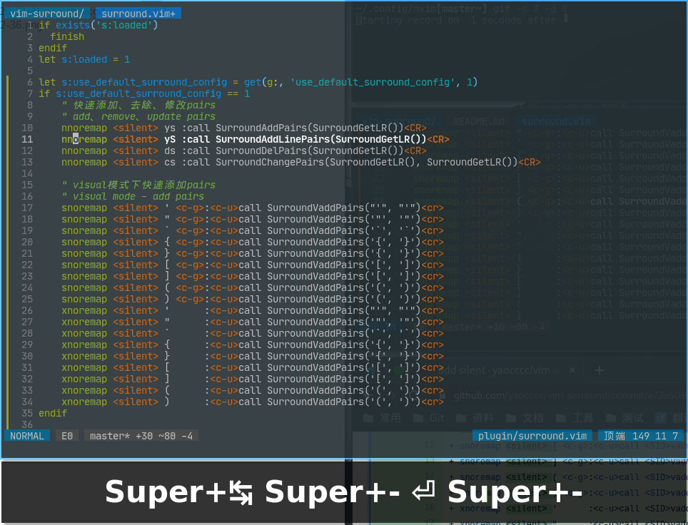
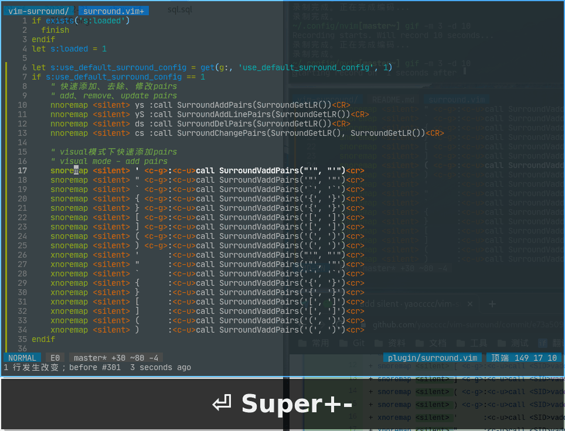

# vim-surround

## features


normal mode

1. ys + surround will add surround to current word
2. yS + surround will add surround to current line
3. ds + surround will del surround
4. cs + surround1 + surround2, will replace surround1 to surround2


visual mode
select some content then input (){}[]'"` will add surround

## config

```config
如果你不想使用默认的按键配置，你可以设置 let g:use_default_surround_config = 0, 并且自定义map
if needn't use default config, you should let g:use_default_surround_config = 0, and set maps

如果你不想使用toggle功能，你可以设置 let g:use_toggle_surround = 0
if needn't use toggle func, you should let g:use_toggle_surround = 0

默认配置
default config

添加、去除、修改pairs
add、remove、update pairs
    nnoremap <silent> ys :call SurroundAddPairs(SurroundGetLR())<CR>
    nnoremap <silent> yS :call SurroundAddLinePairs(SurroundGetLR())<CR>
    nnoremap <silent> ds :call SurroundDelPairs(SurroundGetLR())<CR>
    nnoremap <silent> cs :call SurroundChangePairs(SurroundGetLR(), SurroundGetLR())<CR>

visual模式下添加pairs
visual mode - add pairs
    snoremap <silent> ' <c-g>:<c-u>call SurroundVaddPairs("'", "'")<cr>
    snoremap <silent> " <c-g>:<c-u>call SurroundVaddPairs('"', '"')<cr>
    snoremap <silent> ` <c-g>:<c-u>call SurroundVaddPairs('`', '`')<cr>
    snoremap <silent> { <c-g>:<c-u>call SurroundVaddPairs('{', '}')<cr>
    snoremap <silent> } <c-g>:<c-u>call SurroundVaddPairs('{', '}')<cr>
    snoremap <silent> [ <c-g>:<c-u>call SurroundVaddPairs('[', ']')<cr>
    snoremap <silent> ] <c-g>:<c-u>call SurroundVaddPairs('[', ']')<cr>
    snoremap <silent> ( <c-g>:<c-u>call SurroundVaddPairs('(', ')')<cr>
    snoremap <silent> ) <c-g>:<c-u>call SurroundVaddPairs('(', ')')<cr>
    xnoremap <silent> '      :<c-u>call SurroundVaddPairs("'", "'")<cr>
    xnoremap <silent> "      :<c-u>call SurroundVaddPairs('"', '"')<cr>
    xnoremap <silent> `      :<c-u>call SurroundVaddPairs('`', '`')<cr>
    xnoremap <silent> {      :<c-u>call SurroundVaddPairs('{', '}')<cr>
    xnoremap <silent> }      :<c-u>call SurroundVaddPairs('{', '}')<cr>
    xnoremap <silent> [      :<c-u>call SurroundVaddPairs('[', ']')<cr>
    xnoremap <silent> ]      :<c-u>call SurroundVaddPairs('[', ']')<cr>
    xnoremap <silent> (      :<c-u>call SurroundVaddPairs('(', ')')<cr>
    xnoremap <silent> )      :<c-u>call SurroundVaddPairs('(', ')')<cr>
```

## Support

<a href="https://www.buymeacoffee.com/yaocccc" target="_blank">
  
</a>

<br>

<a href="https://www.buymeacoffee.com/yaocccc" target="_blank">
  
</a>
